100-2rh1-tn.png 
101-PrP-tn.png 
102-3ldh-tn.png 
103-1k4r-1ok8-tn.png 
 
104-3bc8_2yye-tn.png 
105-5rsa-tn.png 
106-1fa0-tn.png 
107-2oau_composite_400-tn.png 
 
108-2cg9_composite-tn.png 
109-2tmv_composite-tn.png 
10-ribosome-tn.png 
110-2p1p-tn.png 
 
111-hydrogenases-tn.png 
11-1rcx-tn.png 
112-1gt0_composite-tn.png 
113-Influenza_Neuraminidase-neuraminidases-tn.png 
 
114-vaults-tn.png 
115-1sgz_1py1-tn.png 
116-sulfotransferases-tn.png 
117-1fo4_composite-tn.png 
 
118-2zxe_composite-tn.png 
119-lattice-tn.png 
120-1kdf-tn.png 
121-2wdk_2wdl_front-tn.png 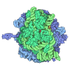
 
122-enhanceosome-tn.png 
123-3g61_composite-tn.png 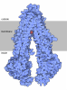
124-1cvn-tn.png 
125-1fpv_2cas-tn.png 
 
126-mom126_egfr-tn.png 
127-mom127_crystallins2-tn.png 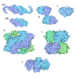
128-mom128_interferons-tn.png 
129-pdb129-3blw_9icd-tn.png 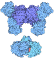
 
12-pepsin-pepsinogen-tn.png 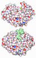
130-mom130-1u8d-tn.png 
131-1jva-tn.png 
13-1htb-tn.png 
 
132-Adenovirus_adenovirus-tn.png 
133-NitricOxideSynthase_nNOS-tn.png 
134-mom134_1jv2-2k9j-1m8o-tn.png 
135-mom135_3os1_composite-tn.png 
 
136-Nanobodies_antibody_nanobody-tn.png 
137-Cytochromebc1_3h1j-tn.png 
138-Glucansucrase_3aic-tn.png 
139-DNAMethylases_DNMT-tn.png 
 
140-RhomboidProteaseGlpG_2nrf_membrane-tn.png 
141-OGlcNAcTransferase_3pe4_1w3b-tn.png 
142-PDBPioneers_oxygencarrier-tn.png 
143-TollLikeReceptors_3fxi_2j67-tn.png 
 
144-ComplexI_3m9s_3rko-tn.png 
145-MessengerRNACapping_3kyh_1ri1-tn.png 
146-AminoglycosideAntibiotics_3frh_3pb3-tn.png 
147-Rhodopsin_1f88-tn.png 
 
148-RasProtein_5p21-tn.png 
149-Leptin_1ax8-tn.png 
14-Insulin-4ins-tn.png 
150-SlidingClamps_3u5z_open-tn.png 
 
151-HGPRT_1hmp-tn.png 
152-cAMP-dependentProteinKinase_PKA-tn.png 
153-PyruvateDehydrogenaseComplex_pyruvatedehydrogenase-tn.png 
154-CitricAcidCycle_citricacidcycle-tn.png 
 
15-4tna-figure-tn.png 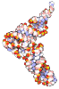
155-VitaminDReceptor_VDRcryo-tn.png 
156-ABOBloodTypeGlycosyltransferases_3i0g_composite-tn.png 
157-TransferMessengerRNA_3iyr_composite-tn.png 
 
158-ProtonGatedUreaChannel_3ux4-tn.png 
159-Erythrocruorin_2gtl-tn.png 
160-Actinomycin_173d_composite-tn.png 
16-1asz-tn.png 
 
161-Ricin_2aai-tn.png 
162-Dermcidin_2ymk_twoviews-tn.png 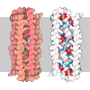
163-HIVCapsid_capsid_composite-tn.png 
164-SerotoninReceptor_4iar-tn.png 
 
165-DesignedProteinCages_3vdx_4egg-tn.png 
166-Proteasome_4b4t_dimer-tn.png 
167-SNAREProteins_1sfc_1br0-tn.png 
168-DNAHelicase_4esv-tn.png 
 
169-HIVEnvelopeGlycoprotein_4nco_composite-tn.png 
170-BroadlyNeutralizingAntibodies_4nco_bnAb-tn.png 
171-NeurotransmitterTransporters_4m48-tn.png 
17-1prh-figure-tn.png 
 
172-RecAAndRad51_recA_filament-tn.png 
173-Aquaporin_1fqy-tn.png 
174-GFPLikeProteins_1g7k-tn.png 
175-Microtubules_3j2u-tn.png 
 
176-Dynein_3vkh-label-tn.png 
177-Apoptosomes_human_apoptosome-tn.png 
178-EbolaVirusProteins_EbolaProteins-tn.png 
179-MethylCoenzymeMReductase_1mro-tn.png 
 
180-TALEffectors_3ugm-tn.png 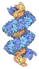
18-1b7t-tn.png 
181-CascadeAndCRISPR_1vy8-tn.png 
182-InsulinReceptor_insulinreceptor-tn.png 
 
183-Phototropin_phototropin-tn.png 
184-Glucagon_glucagonreceptor-tn.png 
185-Titin_sarcomere_titin-tn.png 
186-ReceptorForAdvancedGlycationEndProducts_4lp5_figure-tn.png 
 
187-New_Delhi_MetalloBetaLactamase-4eyl-tn.png 
188-TetrahydrobiopterinBiosynthesis_1gtp_1gtq_1sep-tn.png 
189-Amyloids_2m4j-tn.png 
190-TwoComponentSystems_2c2a_3by8-tn.png 
 
191-GlutamateGatedChlorideReceptors_3rif-tn.png 
192-Vancomycin-1fvm-tn.png 
193-Siderocalin-3cmp_composite-tn.png 
194-Designer_Insulins-1trz-tn.png 
 
195-Raf_Protein_Kinases-raf-tn.png 
196-Lead_Poisoning-1qnv-tn.png 
197-Zika_Virus-5ire_glyc-tn.png 
198-betaGalactosidase-1jz8-tn.png 
 
199-Monellin-SuperSweetHomepage-tn.png 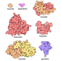
19-Actin-actin18-tn.png 
1-Myoglobin-geis-0218-myoglobin-tn.png 
200-Quasisymmetry_in_Icosahedral_Viruses-1ohf_homepage2-tn.png 
 
201-Isoprene_Synthase-3n0g_homepage-tn.png 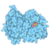
202-Dipeptidyl_Peptidase4-1nu8_homepage-tn.png 
203-PD1_Programmed_Cell_Death_Protein_1-203_homepage-tn.png 
204-Aminopeptidase_1_and_Autophagy-4r8f_homepage-tn.png 
 
205-Nuclear_Pore_Complex-NPC_homepage-tn.png 
206-Globin_Evolution-Globin_Homepage-tn.png 
207-Photoactive_Yellow_Protein-2pyp_homepage-tn.png 
208-Glucose_Transporters-4pyp_4zwc_homepage-tn.png 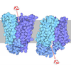
 
209-Tissue_Transglutaminase_and_Celiac_Disease-2q3z_3ly6_homepage-tn.png 
20-picornaviruses-tn.png 
210-Adenine_Riboswitch_in_Action-5e54_5swe_homepage-tn.png 
21-1igt-tn.png 
 
211-Pilus_Machine-3jc8_homepage-tn.png 
212-Glutathione_Transferases-3gss_homepage-tn.png 
213-Sirtuins-4iao_homepage-tn.png 
214-Chimeric_Antigen_Receptors-CAR_homepage-tn.png 
 
215-Aspartate_Transcarbamoylase-5at1_homepage-tn.png 
216-Biodegradable_Plastic-5t6o_homepage-tn.png 
217-Opioid_Receptors-4dkl-homepage-tn.png 
218-EPSP_Synthase_and_Weedkillers-2gg4_2gga_homepage-tn.png 
 
219-Vacuolar_ATPase-5vox_homepage-tn.png 
2-1cd3_mature-tn.png 
220-Dehalogenases-4ur0-homepage-tn.png 
22-1jb0-tn.png 
 
221-Proteins_and_Nanoparticles-5et3_homepage-tn.png 
222-Human_Papillomavirus_and_Vaccines-6bt3-homepage2-tn.png 
223-Piezo1_Mechanosensitive_Channel-6b3r_homepage-tn.png 
224-Legumain-4awb_homepage-tn.png 
 
225-Phytase-1dkq_homepage-tn.png 
226-Aminoglycoside_Antibiotics_and_Resistance-1fjg_homepage-tn.png 
227-Telomerase-6d6v-homepage-tn.png 
228-Directed_Evolution_of_Enzymes-5ucw_homepage-tn.png 
 
229-Fluorescent_RNA_AptamersSpinach_fluorescent_aptamer_with_RNA_in_light_orange_and_fluorophore_in_green-4kzd_homepage-tn.png 
230-Initiation_Factor_eIF4E-1rf8_homepage-tn.png 
231-Proteins_and_Biominerals-1q8h_homepage-tn.png 
232-Measles_Virus_Proteins-4uft_homepage-tn.png 
 
233-SNitrosylated_Hemoglobin-1buw_homepage-tn.png 
234-MDM2_and_Cancer-MDM2_homepage-tn.png 
235-AMPA_Receptor-3kg2_homepage-tn.png 
236-Cyclin_and_Cyclindependent_Kinase-1fin_homepage-tn.png 
 
237-Nanodiscs_and_HDL-6clz_homepage-tn.png 
238-Ribonucleotide_Reductase-1mrr_3r1r_homepage-tn.png 
239-Phospholipase_A2-1bp2_homepage-tn.png 
23-B-DNA-tn.png 
 
240-HypoxiaInducible_Factors-1lqb_homepage-tn.png 
241-Twenty_Years_of_Molecules-6j4y_homepage-tn.png 
242-Voltagegated_Sodium_Channels-6j8j_homepage-tn.png 
243-Coronavirus_Proteases-6lu7_homepage-tn.png 
 
244-Photosynthetic_Supercomplexes-5xnl_homepage-tn.png 
245-Spliceosomes-3jb9_homepage-tn.png 
246-Coronavirus_Spike-6crz_6vxx_homepage2-tn.png 
24-6gpb-2views-tn.png 
 
247-Myelinassociated_Glycoprotein-5lf5_homepage3-tn.png 
248-Phytosulfokine_Receptor-4z64_homepage-tn.png 
249-SARSCoV2_RNAdependent_RNA_Polymerase-6yyt_homepage-tn.png 
250-Capsaicin_Receptor_TRPV1-5is0_homepage-tn.png 
 
25-Thrombin-1ppb-transparent-tn.png 
26-1n2c-tn.png 
27-1fbb-twoviews-tn.png 
28-anthrax-toxin-tn.png 
 
29-3pte-tn.png 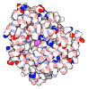
30-1fpy-twoviews-tn.png 
31-p53-unbound-tn.png 
3-1tau-tn.png 
 
32-chaperonin-tn.png 
33-3hvt-tn.png 
34-7dfr-tn.png 
35-ferritin-tn.png 
 
36-3cyt-twoviews-tn.png 
37-1e7i-tn.png 
38-1bl8-tn.png 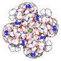
39-lac-tn.png 
 
40-1i6h-composite-tn.png 
41-2dhb-tn.png 
42-1gfl-tn.png 
43-2src-tn.png 
 
44-3cln-tn.png 
45-1hcq-1a52-tn.png 
46-serine-proteases-tn.png 
47-1sva_DNA-tn.png 
 
48-1cgp-tn.png 
49-carbonic-anhydrases-tn.png 
4-collagen-tn.png 
50-glycolysis-tn.png 
 
51-1eul-membrane-tn.png 
5-1oco-tn.png 
52-hormones-tn.png 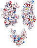
53-1psi-tn.png 
 
54-1acj-tn.png 
55-1a0i-1dgs-tn.png 
56-caspases-tn.png 
57-7cat-tn.png 
 
58-1gg2-composite-tn.png 
59-1s5l-membrane-tn.png 
60-ubiquitin-tn.png 
61-2pah-1phz-tn.png 
 
62-1hsa-tn.png 
63-1tcr-tn.png 
6-3hvp-tn.png 
64-3kin-composite-tn.png 
 
65-1u6b-tn.png 
66-2biw-composite-tn.png 
67-1cdw-tn.png 
68-1bet-tn.png 
 
69-1xtc-tn.png 
70-1qys-composite-tn.png 
71-2bg9-composite-tn.png 
7-1aoi-tn.png 
 
72-ATPsynthase-tn.png 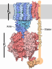
73-1a36-tn.png 
74-1ppi-tn.png 
75-2hft-tn.png 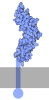
 
76-1ruz-tn.png 
77-1gpe-tn.png 
78-2d1s-tn.png 
79-app-composite-tn.png 
 
80-1yyf-tn.png 
81-1ttt-tn.png 
82-1w0e-2j0d-tn.png 
83-1m1j-composite-tn.png 
 
84-1muh-tube-tn.png 
85-1qgk-composite-tn.png 
86-2nn6-tn.png 
87-1tf6-1un6-tn.png 
 
88-1xi4-tn.png 
89-2b3y-2ipy-tn.png 
8-ecorI-tn.png 
90-fas-tn.png 
 
91-1n4e-tn.png 
92-1d2s-composite-tn.png 
9-2lyz-tn.png 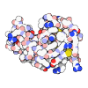
93-pdb93_1cts-2cts-tn.png 
 
94-Superoxide_Dismutase-94-SuperoxideDismutase-2sod-tn.png 
95-2onj-tn.png 
96-1w6k-tn.png 
97-Kai-proteins-tn.png 
 
98-siRNA-tn.png 
99-1l3w-1i7x-tn.png 
